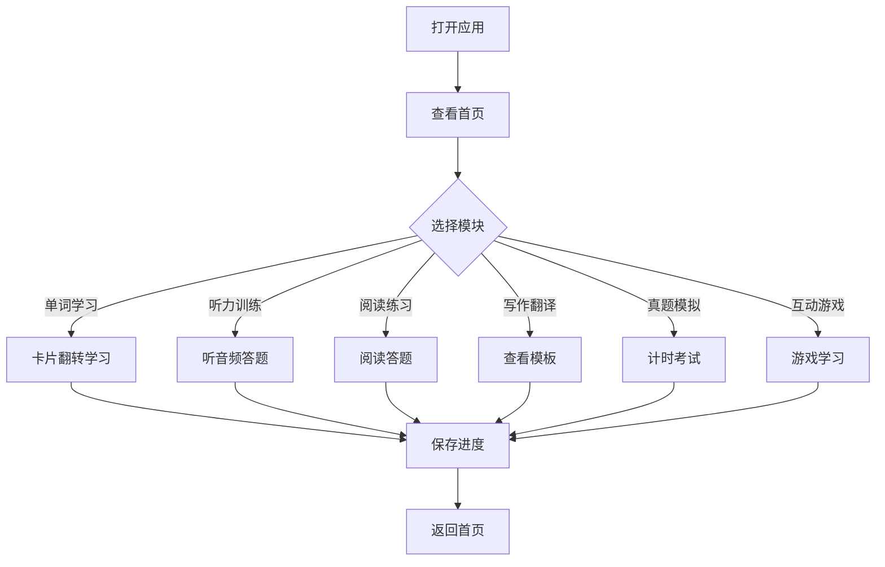

## 1. Product Overview
一款面向大学英语四级考试的现代化学习应用，采用卡片式 UI 和丰富动画效果，帮助用户高效记忆单词、提升听力阅读能力，通过互动游戏增强学习趣味性。
- 核心功能：单词学习、听力训练、阅读练习、写作翻译、真题模拟
- 互动游戏：单词消消乐、拼写挑战、听力打地鼠、每日打卡
- 目标用户：准备大学英语四级考试的学生

## 2. Core Features

### 2.1 User Roles
| Role | Registration Method | Core Permissions |
|------|---------------------|------------------|
| Normal User | Local (无需注册) | 完整学习功能、游戏、进度保存 |

### 2.2 Feature Module
1. **首页**: 学习统计、今日任务、快速入口
2. **单词学习**: 卡片翻转、单词列表、分类筛选
3. **听力训练**: 短对话、长对话、新闻听力
4. **阅读练习**: 选词填空、长篇阅读、仔细阅读
5. **写作翻译**: 句型模板、高频话题
6. **真题模拟**: 10 套模拟题、计时器、评分
7. **互动游戏**: 消消乐、拼写挑战、听力打地鼠
8. **学习中心**: 错题本、进度统计、设置

### 2.3 Page Details
| Page Name | Module Name | Feature description |
|-----------|-------------|---------------------|
| 首页 | 学习统计 | 显示已学单词数、连续打卡天数、今日学习时长 |
| 首页 | 今日任务 | 推荐今日学习内容、待完成任务 |
| 首页 | 快速入口 | 各模块快捷跳转按钮 |
| 单词学习 | 卡片翻转 | 3D 翻转动画展示单词和释义 |
| 单词学习 | 分类筛选 | 校园、科技、文化、环境、经济分类 |
| 听力训练 | 音频播放 | 模拟考试听力题型 |
| 阅读练习 | 文章阅读 | 模拟考试阅读题型 |
| 写作翻译 | 模板展示 | 常用句型和话题示例 |
| 真题模拟 | 计时答题 | 完整模拟考试体验 |
| 互动游戏 | 游戏界面 | 多种互动游戏 |
| 学习中心 | 数据统计 | 学习进度可视化 |
| 学习中心 | 设置 | 暗黑/亮色模式切换、数据导出 |

## 3. Core Process
用户打开应用 → 查看首页统计 → 选择学习模块 → 进行学习/游戏 → 完成后保存进度 → 查看统计数据

## 4. User Interface Design

### 4.1 Design Style
- **主色调**: 蓝紫渐变 (#667eea → #764ba2) / 橙粉渐变 (#f093fb → #f5576c)
- **按钮样式**: 圆角胶囊、毛玻璃效果、hover 上浮
- **字体**: 中文使用思源黑体，英文使用 Poppins
- **布局**: 卡片式设计，响应式 Grid/Flexbox
- **图标**: Lucide React

### 4.2 Page Design Overview
| Page Name | Module Name | UI Elements |
|-----------|-------------|-------------|
| 首页 | 学习统计 | 圆形进度环、数据卡片、渐变背景 |
| 首页 | 今日任务 | 任务列表、进度条、动画效果 |
| 单词学习 | 卡片翻转 | 3D 翻转卡片、音标、释义、例句 |
| 听力训练 | 音频播放 | 播放控制、题目选项、进度条 |
| 阅读练习 | 文章阅读 | 文章卡片、选项列表、滚动区域 |
| 互动游戏 | 游戏界面 | 网格布局、动画效果、分数显示 |
| 学习中心 | 设置 | 模式切换开关、数据导出按钮 |

### 4.3 Responsiveness
- 桌面端：多栏网格布局
- 平板端：双栏布局
- 移动端：单栏布局，底部导航

### 4.4 Animation Effects
- 页面切换：CSS 滑动/淡入淡出过渡
- 单词卡片：3D 翻转动画
- 进度条：CSS 流动动画
- 成就徽章：弹出弹跳动画
- 正确/错误反馈：对勾/叉号动画 + 粒子特效
- 加载状态：跳动圆点动画
- 每日打卡：日历翻页动画
