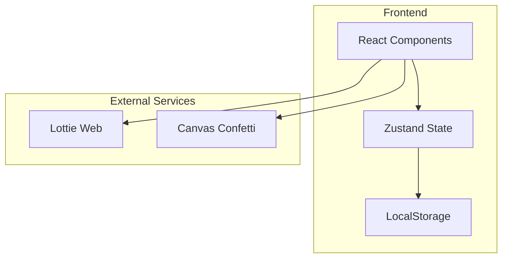

## 1. Architecture Design


## 2. Technology Description
- Frontend: React@18 + TypeScript + TailwindCSS@3 + Vite
- State Management: Zustand
- Animation: CSS Keyframes + Lottie Web + Canvas Confetti
- Icons: Lucide React
- Data Storage: LocalStorage
- Build Tool: Vite

## 3. Route Definitions
| Route | Purpose |
|-------|---------|
| / | 首页 |
| /words | 单词学习 |
| /listening | 听力训练 |
| /reading | 阅读练习 |
| /writing | 写作翻译 |
| /exam | 真题模拟 |
| /games | 互动游戏 |
| /profile | 学习中心 |

## 4. API Definitions
无后端 API，纯前端应用，使用 LocalStorage 存储数据。

## 5. Server Architecture Diagram
无后端服务器，纯前端应用。

## 6. Data Model

### 6.1 Data Model Definition

```mermaid
erDiagram
    USER_PROGRESS {
        string userId PK
        number learnedWords
        number streakDays
        number totalStudyTime
        number examScore
    }
    
    WORD {
        string id PK
        string word
        string phonetic
        string meaning
        string example
        string synonyms
        string tip
        string category
    }
    
    WORD_PROGRESS {
        string wordId FK
        number mastery
        number lastStudyDate
        boolean isLearned
    }
    
    WRONG_ANSWER {
        string id PK
        string type
        string question
        string userAnswer
        string correctAnswer
        number timestamp
    }
    
    USER_PROGRESS ||--o{ WORD_PROGRESS : "has"
    WORD ||--o{ WORD_PROGRESS : "tracks"
    USER_PROGRESS ||--o{ WRONG_ANSWER : "has"
```


### 6.2 Data Structure (LocalStorage)
```typescript
interface UserProgress {
  learnedWords: number;
  streakDays: number;
  totalStudyTime: number;
  todayStudyTime: number;
  lastCheckInDate: string;
  moduleProgress: {
    words: number;
    listening: number;
    reading: number;
    writing: number;
    exam: number;
    games: number;
  };
}

interface WordProgress {
  [wordId: string]: {
    mastery: number;
    lastStudyDate: string;
    isLearned: boolean;
  };
}

interface WrongAnswer {
  id: string;
  type: 'listening' | 'reading' | 'exam';
  question: string;
  userAnswer: string;
  correctAnswer: string;
  timestamp: number;
}
```

### 6.3 Mock Data
- 2000 高频四级词汇
- 10 套模拟真题
- 听力材料（文本形式）
- 阅读文章（模拟文章）
- 写作模板
